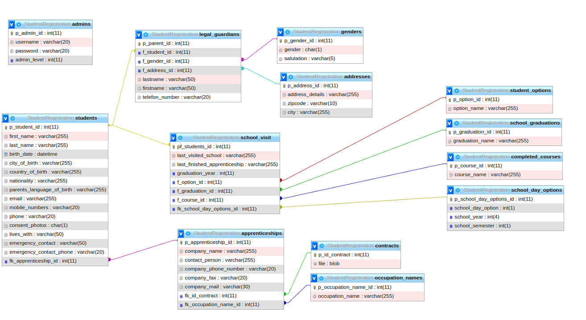

# Import alle Migrationen in Xampp
- Gehe auf Xampp Phpadmin
- Klicke auf "import" in dem Upper Bar
- Nachdem Klicken ein Fenster wird geöffnet, indem das Filesystem steht.
- Suche nach all_migrations.zip und Klicke darauf
- Ein "Go" Button ist am ende der Seite verfügbar, klicke darauf.
- und Boom, du hast es geschafft! 

## Database ER

# Festgelegte SQL-Naming Conventions
Konventionen für Tabellen- und Spaltennamen.

### Tabellennamen
- klein geschrieben
- Plural
- Snake_case

### Spaltennamen
- klein geschrieben
- Singular
- Snake_case
- Schlüsselattribute kennzeichnen mit "p_" für Primary-, "f_" für Foreign-Key
- Schlüsselattribute enden mit "_id", "_nr", ...

### Beispiel:
#### chosen_options
- p_chosen_option_id *int* PRIMARY KEY
- chosen_option *int*

Besprochen am 14.02.24
